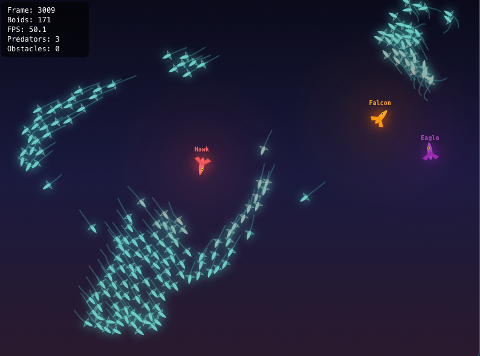

# Boids Interactive Demo

A real-time, interactive flocking simulation implementing Craig Reynolds' Boids algorithm. Features a high-performance Python backend streaming simulation frames via WebSocket to a responsive React frontend.




---

## Table of Contents

- [Overview](#overview)
- [Features](#features)
- [Quick Start](#quick-start)
- [Project Structure](#project-structure)
- [Usage Guide](#usage-guide)
- [API Reference](#api-reference)
- [Configuration](#configuration)
- [Architecture](#architecture)
- [Analysis Tools](#analysis-tools)
- [Testing](#testing)
- [Performance](#performance)
- [Technology Stack](#technology-stack)
- [Development](#development)
- [License](#license)
- [Acknowledgments](#acknowledgments)

---

## Overview

The **Boids algorithm**, created by Craig Reynolds in 1986, simulates the flocking behavior of birds using three simple rules:

1. **Separation**: Steer to avoid crowding nearby flockmates
2. **Alignment**: Steer towards the average heading of nearby flockmates  
3. **Cohesion**: Steer towards the average position of nearby flockmates

This project extends the classic algorithm with predator-prey dynamics, obstacle avoidance, and real-time parameter tuning visualized in an nteractive web interface.

---

## Features

### Core Simulation
- **60 FPS WebSocket streaming** — Real-time frame delivery
- **Live parameter tuning** — Adjust all behavior parameters instantly
- **KD-Tree optimization** — O(n log n) neighbor queries for smooth performance
- **Real-time metrics** — FPS counter, boid count, distance tracking

### Predator-Prey Dynamics
- **Multiple predators** — Up to 5 simultaneous predators
- **Hunting strategies** — 5 unique AI behaviors per predator species
- **Emergent defense** — Watch flocks naturally evade and regroup

### Visual & Interactive
- **Strategy-colored predators** — Each hunting style has a distinct color
- **Static obstacles** — Add circular barriers boids navigate around
- **Preset behaviors** — One-click loading of interesting configurations
- **Playback controls** — Pause, resume, and reset simulation

### Deployment
- **Docker ready** — Single command deployment

---

## Quick Start

### Option 1: Docker (Recommended)

```bash
# Clone the repository
git clone https://github.com/yourusername/boids-interactive.git
cd boids-interactive

# Build and run
docker compose up --build

# Open in browser
open http://localhost:8080
```

### Option 2: Local Development

**Prerequisites:** Python 3.10+, Node.js 20+

**Terminal 1 — Backend:**
```bash
cd backend
python -m venv venv
source venv/bin/activate  # Windows: venv\Scripts\activate
pip install -r requirements.txt
python main.py
```

**Terminal 2 — Frontend:**
```bash
cd frontend
npm install
npm run dev
```

Open **http://localhost:5173** in your browser.

---

## Project Structure

```
boids-interactive/
├── docker-compose.yml          # Container orchestration
├── README.md                   # This file
├── GENAI_USAGE.md             # Development documentation
│
├── backend/
│   ├── Dockerfile             # Backend container
│   ├── main.py                # FastAPI WebSocket server
│   ├── simulation_manager.py  # Simulation lifecycle management
│   ├── config.py              # Parameters & validation
│   ├── models.py              # Pydantic message models
│   ├── presets.py             # Preset configurations
│   ├── requirements.txt       # Python dependencies
│   │
│   ├── boids/                 # Simulation engine
│   │   ├── __init__.py
│   │   ├── boid.py            # Boid entity
│   │   ├── predator.py        # Predator with hunting strategies
│   │   ├── flock.py           # Basic flock manager
│   │   ├── flock_optimized.py # KD-Tree optimized flock
│   │   ├── obstacle.py        # Static obstacles
│   │   ├── rules.py           # Flocking behavior rules
│   │   ├── rules_optimized.py # Vectorized rules
│   │   └── metrics.py         # Analysis metrics
│   │
│   ├── tests/                 # Test suite (357 tests)
│   │   ├── test_simulation.py
│   │   ├── test_websocket.py
│   │   ├── test_predator_strategies.py
│   │   └── ...
│   │
│   ├── analysis.py            # Parameter sweep experiments
│   ├── benchmark.py           # Performance comparison
│   └── visualization.py       # Pygame visualization
│
├── frontend/
│   ├── Dockerfile             # Frontend container
│   ├── nginx.conf             # Nginx + WebSocket proxy
│   ├── package.json           # Node dependencies
│   ├── index.html
│   └── src/
│       ├── App.tsx            # Main React application
│       ├── App.css            # Styles
│       ├── main.tsx           # Entry point
│       └── index.css          # Global styles
│
└── docs/
    └── CONTAINERIZATION_PLAN.md
```

---

## Usage Guide

### Basic Controls

1. **Connect** — Click to establish WebSocket connection
2. **Disconnect** — Close the connection
3. **Pause/Resume** — Toggle simulation playback
4. **Reset** — Reinitialize with current parameters

### Parameter Sliders

| Parameter | Range | Description |
|-----------|-------|-------------|
| Number of Boids | 1-200 | Population size |
| Visual Range | 10-150 | Perception radius (pixels) |
| Separation | 0.01-0.5 | Collision avoidance strength |
| Cohesion | 0.0001-0.02 | Flock centering strength |
| Alignment | 0.01-0.2 | Velocity matching strength |
| Max Speed | 1-8 | Maximum boid velocity |
| Min Speed | 0-3 | Minimum boid velocity |

### Predator Controls

| Parameter | Range | Description |
|-----------|-------|-------------|
| Enable Predator | On/Off | Toggle predator presence |
| # Predators | 1-5 | Number of active predators |
| Predator Speed | 0.5-5 | Predator velocity |
| Avoidance Strength | 0.05-1.5 | Boid flee response |

### Presets

| Preset | Description |
|--------|-------------|
| **Default** | Balanced flocking behavior |
| **Tight Swarm** | High cohesion, tight formations |
| **Loose Cloud** | Low cohesion, spread out |
| **High Speed** | Fast-moving flock |
| **Slow Dance** | Graceful, slow movements |
| **Predator Chase** | Active hunting scenario |
| **Swarm Defense** | Strong predator avoidance |

### Predator Strategies

When multiple predators are enabled, each uses a unique hunting strategy:

| Strategy | Color | Behavior |
|----------|-------|----------|
| **Hawk** | Red | Targets flock center mass |
| **Falcon** | Orange | Chases nearest boid |
| **Eagle** | Yellow | Hunts stragglers at edges |
| **Kite** | Green | Patrols in circular patterns |
| **Osprey** | Blue | Randomly switches targets |

---

## API Reference

### WebSocket Endpoint

```
ws://localhost:8000/ws        # Local development
ws://localhost:8080/ws        # Docker (via nginx proxy)
```

### Server → Client Messages

**Frame Data** (sent at ~60 FPS):
```json
{
  "type": "frame",
  "frame_id": 1234,
  "boids": [[x, y, vx, vy], ...],
  "predators": [
    {
      "x": 400, "y": 300,
      "vx": 1.5, "vy": -0.8,
      "strategy": 0,
      "strategy_name": "Hawk"
    }
  ],
  "obstacles": [[x, y, radius], ...],
  "metrics": {
    "fps": 60.0,
    "avg_distance_to_predator": 150.5,
    "min_distance_to_predator": 45.2
  }
}
```

**Parameter Sync** (sent on connect and after changes):
```json
{
  "type": "params_sync",
  "params": {
    "num_boids": 50,
    "visual_range": 50,
    "separation_strength": 0.15,
    "cohesion_factor": 0.002,
    "alignment_factor": 0.06,
    "max_speed": 3.0,
    "min_speed": 0.0,
    "predator_enabled": true,
    "predator_speed": 2.5,
    "num_predators": 1
  }
}
```

**Error Message**:
```json
{
  "type": "error",
  "message": "Invalid parameter: num_boids must be between 1 and 200"
}
```

### Client → Server Messages

**Update Parameters**:
```json
{"type": "update_params", "params": {"num_boids": 100, "visual_range": 75}}
```

**Playback Control**:
```json
{"type": "pause"}
{"type": "resume"}
{"type": "reset"}
```

**Apply Preset**:
```json
{"type": "preset", "name": "predator_chase"}
```

**Obstacle Management**:
```json
{"type": "add_obstacle", "x": 400, "y": 300, "radius": 30}
{"type": "remove_obstacle", "index": 0}
{"type": "clear_obstacles"}
```

### REST Endpoints

| Endpoint | Method | Description |
|----------|--------|-------------|
| `/` | GET | Service info |
| `/health` | GET | Health check |

---

## Configuration

### Backend Configuration (`backend/config.py`)

All simulation parameters with validation ranges:

```python
# Boid Behavior
num_boids: int           # 1-200, default 50
visual_range: float      # 10-150, default 50
protected_range: float   # 5-50, default 20
separation_strength: float  # 0.01-0.5, default 0.15
cohesion_factor: float   # 0.0001-0.02, default 0.002
alignment_factor: float  # 0.01-0.2, default 0.06

# Speed Limits
max_speed: float         # 1-8, default 3.0
min_speed: float         # 0-3, default 0.0

# Boundary Behavior
margin: float            # 25-150, default 75
turn_factor: float       # 0.1-1.0, default 0.2

# Predator Settings
predator_enabled: bool   # default False
num_predators: int       # 1-5, default 1
predator_speed: float    # 0.5-5, default 2.5
predator_detection_range: float  # 50-300, default 150
predator_avoidance_strength: float  # 0.05-1.5, default 0.8

# Simulation
width: float             # 800 (fixed)
height: float            # 600 (fixed)
target_fps: int          # 60
```

### Environment Variables

| Variable | Default | Description |
|----------|---------|-------------|
| `VITE_WS_URL` | `/ws` | WebSocket URL (Docker) |

---

## Architecture

```
┌─────────────────────────────────────────────────────────────────┐
│                         Client Browser                          │
│  ┌───────────────────────────────────────────────────────────┐  │
│  │                    React Frontend                         │  │
│  │  ┌─────────────┐  ┌─────────────┐  ┌─────────────────┐   │  │
│  │  │   Canvas    │  │  Controls   │  │  WebSocket Hook │   │  │
│  │  │  Renderer   │  │   Panel     │  │                 │   │  │
│  │  └─────────────┘  └─────────────┘  └────────┬────────┘   │  │
│  └─────────────────────────────────────────────│─────────────┘  │
└────────────────────────────────────────────────│────────────────┘
                                                 │ WebSocket
                                                 ▼
┌─────────────────────────────────────────────────────────────────┐
│                        Docker Compose                           │
│                                                                 │
│  ┌─────────────────────┐      ┌─────────────────────────────┐  │
│  │   Frontend (Nginx)  │      │      Backend (FastAPI)      │  │
│  │                     │      │                             │  │
│  │  - Static files     │ /ws  │  ┌───────────────────────┐  │  │
│  │  - WebSocket proxy ─┼──────┼──│  WebSocket Handler    │  │  │
│  │  - Port 8080        │      │  └───────────┬───────────┘  │  │
│  └─────────────────────┘      │              │              │  │
│                               │  ┌───────────▼───────────┐  │  │
│                               │  │ Simulation Manager    │  │  │
│                               │  │                       │  │  │
│                               │  │  - Frame loop (60fps) │  │  │
│                               │  │  - Parameter updates  │  │  │
│                               │  │  - Metrics collection │  │  │
│                               │  └───────────┬───────────┘  │  │
│                               │              │              │  │
│                               │  ┌───────────▼───────────┐  │  │
│                               │  │   FlockOptimized      │  │  │
│                               │  │                       │  │  │
│                               │  │  - KD-Tree queries    │  │  │
│                               │  │  - Boid updates       │  │  │
│                               │  │  - Predator AI        │  │  │
│                               │  │  - Obstacle avoidance │  │  │
│                               │  └───────────────────────┘  │  │
│                               │         Port 8000           │  │
│                               └─────────────────────────────┘  │
└─────────────────────────────────────────────────────────────────┘
```

### Data Flow

1. **Client connects** via WebSocket
2. **Server creates** dedicated `SimulationManager` instance
3. **Frame loop starts** at 60 FPS
4. Each frame:
   - Flock updates all boid positions
   - KD-Tree rebuilt for neighbor queries
   - Predators execute hunting strategies
   - Metrics computed
   - Frame data serialized and sent
5. **Client receives** frame, renders to Canvas
6. **User adjusts** parameters → sent to server → applied immediately

---

## Testing

Run the complete test suite:

```bash
cd backend
pip install pytest pytest-asyncio httpx
pytest tests/ -v
```

### Test Coverage

| Module | Tests | Coverage |
|--------|-------|----------|
| Configuration | 35 | Validation, ranges, edge cases |
| Models | 36 | Message parsing, serialization |
| Simulation | 33 | Boid behavior, flocking rules |
| WebSocket | 15 | Connection, messaging, errors |
| Predator Strategies | 23 | All 5 hunting behaviors |
| Multi-Predator | 23 | Interactions, assignments |
| Obstacles | 34 | Avoidance, placement |
| Boundary | 19 | Edge behavior, regression |
| Hunting | 34 | Chase mechanics, cooldowns |
| Presets | 22 | All preset configurations |
| **Total** | **357** | — |

### Run Specific Tests

```bash
# Run only WebSocket tests
pytest tests/test_websocket.py -v

# Run with coverage report
pytest tests/ --cov=. --cov-report=html
```

---

## Performance

### Benchmarks (M1 MacBook Air)

| Boids | Naive (ms) | KD-Tree (ms) | Speedup |
|------:|-----------:|-------------:|--------:|
| 50 | 2.1 | 0.9 | 2.4x |
| 100 | 7.8 | 1.6 | 4.9x |
| 200 | 30.2 | 3.1 | 9.7x |
| 500 | 185.4 | 7.8 | 23.8x |

### Target Performance

| Metric | Target | Achieved |
|--------|--------|----------|
| Frame Rate | 60 FPS | 60 FPS (local) |
| Docker | 30+ FPS | ~48 FPS |
| Max Boids | 200 |  200 @ 60 FPS |
| Latency | <20ms |  ~16ms |

### Optimization Techniques

- **KD-Tree spatial indexing** — O(n log n) neighbor queries
- **Vectorized NumPy operations** — Batch position/velocity updates
- **Instance reuse** — Minimize object allocation
- **Efficient serialization** — Compact frame format

---

## Display Recommendations

For the best experience:

| Setting | Recommendation |
|---------|----------------|
| **Browser Window** | Square or near-square aspect ratio (800×600 to 1000×800 px) |
| **Full Screen** | Not recommended on wide monitors — may cause layout issues |
| **Zoom Level** | 100% browser zoom for correct sizing |

The simulation canvas is optimized for a fixed 800×600 internal resolution. Resize your browser window to approximately square proportions for optimal display.

---

## Known Limitations

Current implementation limitations (targeted for future releases):

| Limitation | Description | Planned Fix |
|------------|-------------|-------------|
| **Small obstacle avoidance** | Obstacles with radius <20px may not trigger strong enough avoidance; boids can clip through at high speeds | Increase avoidance strength scaling for small obstacles |
| **Docker frame rate** | Achieves ~48-50 FPS vs ~60 FPS local | Container optimization planned |
| **Predator selection** | Predators added by count (1-5) with auto-assigned strategies; cannot select specific strategies (e.g., "5 Hawks") | Individual predator configuration UI |
| **Fixed canvas size** | Internal 800×600 resolution doesn't adapt to window size | Responsive canvas scaling |

---

## Development

### Prerequisites

- Python 3.10+
- Node.js 20+
- Docker (optional)

### Setup Development Environment

```bash
# Clone repository
git clone https://github.com/yourusername/boids-interactive.git
cd boids-interactive

# Backend setup
cd backend
python -m venv venv
source venv/bin/activate
pip install -r requirements.txt
pip install pytest pytest-asyncio httpx  # For testing

# Frontend setup
cd ../frontend
npm install
```

### Development Commands

```bash
# Run backend (with auto-reload)
cd backend
uvicorn main:app --reload --port 8000

# Run frontend (with HMR)
cd frontend
npm run dev

# Run tests
cd backend
pytest tests/ -v

# Build frontend for production
cd frontend
npm run build

# Build Docker images
docker compose build

# Run Docker stack
docker compose up
```

### Code Style

- **Python**: Follow PEP 8
- **TypeScript**: ESLint configuration included
- **Commits**: Conventional commits recommended

---

## License

MIT License — see [LICENSE](LICENSE) for details.

---

## Acknowledgments

- **Craig Reynolds** — Original Boids algorithm (1986)
  - [Original Paper](https://www.red3d.com/cwr/boids/)
  - [Wikipedia: Boids](https://en.wikipedia.org/wiki/Boids)